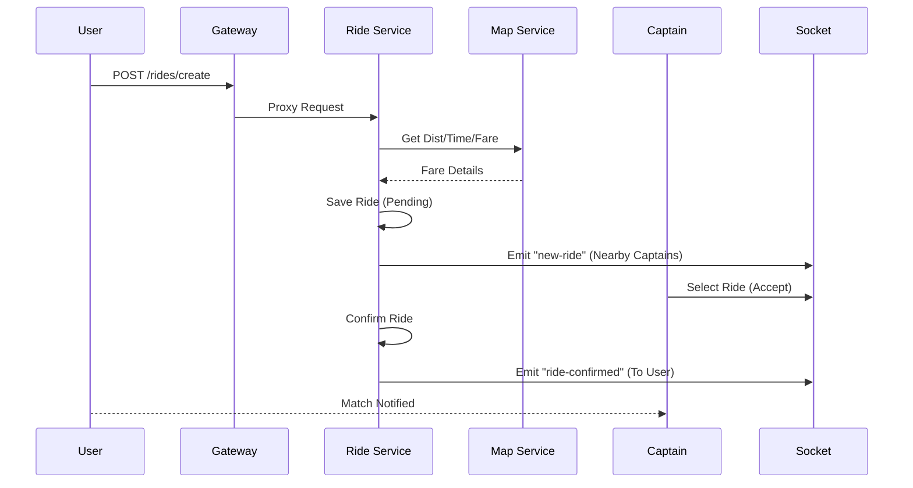

# Uber Clone - Microservices Architecture

A full-stack Uber clone built using a modern microservices architecture, featuring real-time tracking, ride-hailing workflows, and secure authentication.

## 🏗 Architecture Overview

The system is designed with a decoupled microservices approach, where each service is responsible for a specific domain. The architecture is composed of:

-   **Frontend**: Built with React and Vite for a fast and responsive user experience.
-   **API Gateway**: Acts as the single entry point for all frontend requests, routing them to the appropriate backend service.
-   **Microservices**:
    -   **User Service**: Manages user registration, login, and profiles.
    -   **Captain Service**: Handles captain registration, documentation, and availability.
    -   **Map Service**: Interfaces with mapping APIs to calculate distance, travel time, and handle location suggestions.
    -   **Ride Service**: Orchestrates the ride lifecycle, including booking requests, matching, and completion.

---

## 🛠 Tech Stack

-   **Frontend**: React.js, Tailwind CSS, Vite.
-   **Backend**: Node.js, Express.js.
-   **Real-time Communication**: Socket.io.
-   **Database**: MongoDB (Individual databases per microservice).
-   **API Gateway**: `express-http-proxy`.

---

## 🔄 Core Project Flows

### Ride Booking Flow Visualization


### 1. Authentication Flow
- Users and Captains sign up/login through their respective services.
- A secure JWT is issued, which is used for subsequent requests routed through the API Gateway.

### 2. Ride Request Flow
1. **Source & Destination**: The user selects locations on the frontend.
2. **Fare Calculation**: The `Ride Service` requests `Map Service` for distance and potential fares.
3. **Broadcasting**: `Ride Service` emits a socket event (via `Socket.io`) to inform all "Online" captains within a certain radius.

### 3. Ride Acceptance & Confirmation Flow
1. **Captain Accepts**: A captain selects a pending ride request.
2. **Status Update**: `Ride Service` updates the ride state and triggers a confirmation event via Socket.io.
3. **Real-time Notification**: The User is instantly notified of the captain's details and ETA.

### 4. Real-time Ride Lifecycle
- Throughout the journey, the `SocketContext` on the frontend maintains a persistent connection for status updates (e.g., Captain Arrived, Ride Started, Ride Completed).

---

## 🚀 Getting Started

### Prerequisites
-   Node.js (LTS version)
-   MongoDB instance for each service
-   Environment variables for each service (see `.env.example` in respective folders)

### Installation
1.  Clone the repository.
2.  Install dependencies for each service:
    ```bash
    cd Backend/user && npm install
    cd Backend/captain && npm install
    cd Backend/map && npm install
    cd Backend/ride && npm install
    cd Backend/gateway && npm install
    cd frontend && npm install
    ```
3.  Run all services in parallel (preferably use a process manager like PM2 or run in separate terminals).

### Gateway Configuration
The API Gateway runs on `http://localhost:3004` and proxies the following routes:
- `/users` -> User Service
- `/captains` -> Captain Service
- `/maps` -> Map Service
- `/rides` -> Ride Service

---

## 📸 Design & UI
The frontend focuses on a premium and clean user interface, mirroring the modern Uber experience with smooth transitions and real-time state management.
